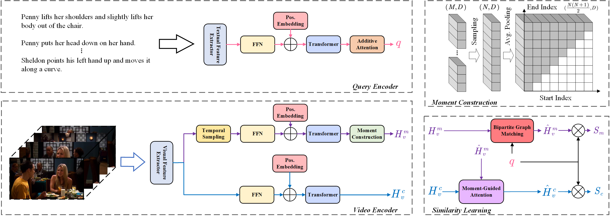

# BGM-Net
PyTorch implementation for the paper "Exploiting Instance-level Relationships in Weakly Supervised Text-to-Video Retrieval", under review in ACM TOMM 2023.

Full code will be available after review. The core of the Bipartite Graph Matching Module (BGMM) is [here](./gadgets/match.py).
## Results
We compare our method against others on three benchmark datasets, i.e., TVR, Activitynet and Charades-STA:

|              | R@1  | R@5  | R@10 | R@100 | SumR  |
|--------------|------|------|------|-------|-------|
| TVR          | 14.1 | 34.7 | 45.9 | 85.2  | 179.9 |
| Activitynet  | 7.2  | 23.8 | 36.0 | 76.9  | 143.9 |
| Charades-STA | 1.9  | 7.4  | 12.2 | 50.1  | 71.6  |

## Environments

OS: Ubuntu 20.04.4 LTS 

Python: 3.8

Pytorch: 1.13.1

CUDA: 11.6, cudnn: 8.4.0

GPU: NVIDIA GeForce RTX 3090 Ti

